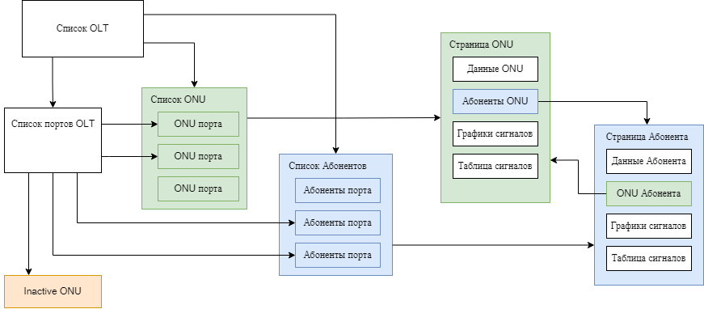

# PON мониторинг

Сервис предназначен для сбора данных с OLT, их хранения и аналитики.

Позволяет добавлять OLT, которые будут опрашиваться с указанной периодичностью.
При опросе автоматически могут быть получены порты OLT, подключенные ONU, данные ONU, показатели ONU (Rx, Tx, температура). Которые в последствии хранятся в виде статистики и могут быть использованы для анализа и диагностики сети.

Полученные данные отображаются в виде таблиц с возможностью поиска, сортировки и фильтрации по любому параметру.
Для каждого ONU отображаются графики и таблицы со статистикой.

В процессе диагностики можно запросить список неактивны ONU (inactive-onu) или получить текущие значения статуса и сигнала для конкретного ONU.

Пользователям можно назначить необходимые права и доступ ко всем или определенным OLT.

### Иерархия разделов: 

1. Список OLT
2. Список портов OLT
3. Список ONU | Список Абонентов
4. Страница ONU | Страница Абонента

### Интерфейс
В шапке на любой странице есть поле общего поиска. Который позволяет искать по большинству полей (mac, номер договора, название абонента и пр.)

В левом верхнем углу расположены хлебные крошки, которые позволяют переходить по разделам в соответствии с иерархией.

При перемотке страницы вниз, в правом нижнем углу появляется кнопка, по клику на которой можно вернуться в начало страницы.

В правом верхнем углу находится иконка переключения темной и светлой темы и меню пользователя с возможностью выйти из системы.

У администратора появляются ссылки на административные разделы.

### Разделы:
- #### [2. Список OLT](2.%20Список%20OLT.md)
- #### [3. Список портов](3.%20Список%20портов.md)
- #### [4. Списки ONU и Абонентов](4.%20Списки%20ONU%20и%20Абонентов.md)
- #### [5. Страница ONU](5.%20Страница%20ONU.md)

